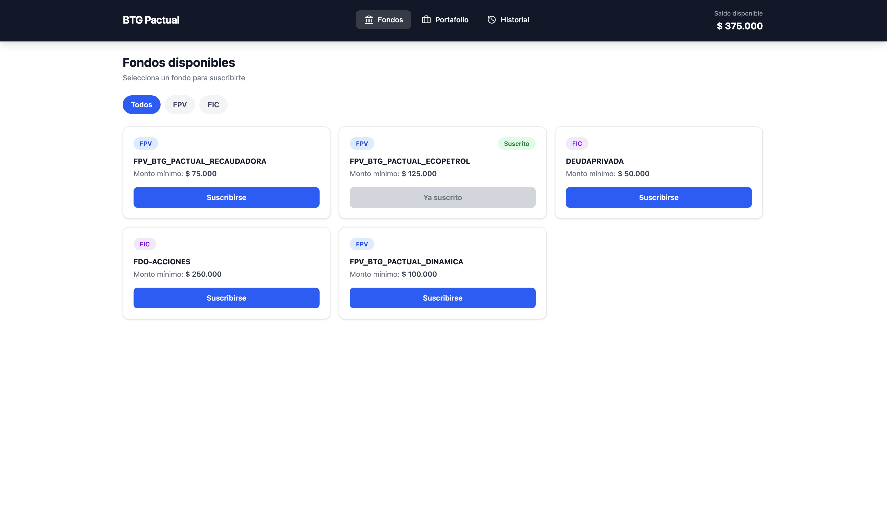
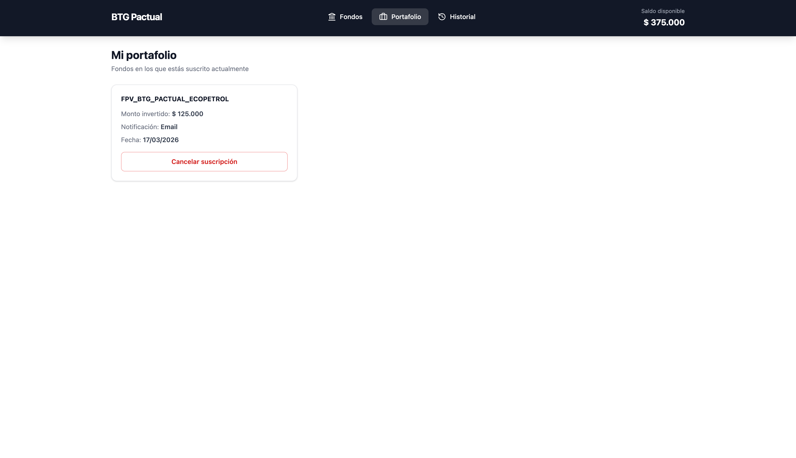
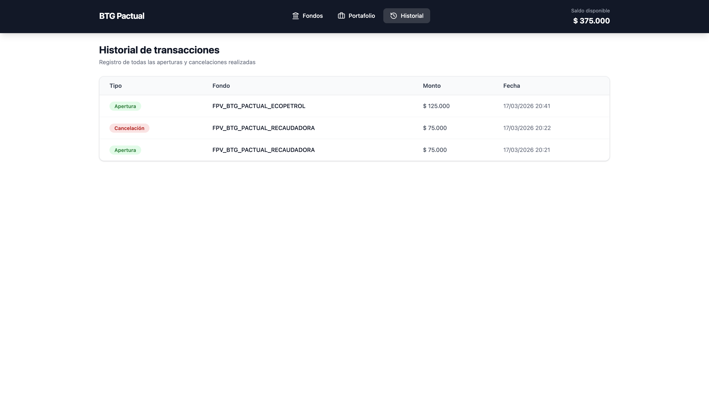
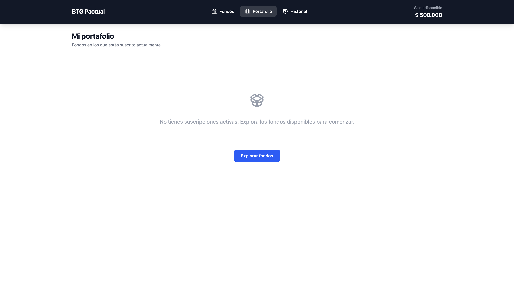

# BTG Pactual - Funds Management

Angular SPA for subscribing to and managing investment funds (FPV and FIC). Built as a technical test for BTG Pactual.

Users can browse a catalog of funds, subscribe by choosing a notification method (Email/SMS), manage their active subscriptions from a portfolio view, and review their full transaction history.

## Features

- **Fund catalog** — browse all available funds, filter by category (FPV / FIC)
- **Subscription flow** — subscribe to a fund with minimum amount validation and notification preference
- **Portfolio** — view active subscriptions, cancel with confirmation dialog and automatic balance refund
- **Transaction history** — chronological log of every subscription and cancellation with timestamps
- **Responsive UI** — adaptive layout for desktop (tables, grid) and mobile (cards, bottom nav)
- **Accessibility** — focus trapping in dialogs, keyboard navigation, ARIA attributes, screen reader support
- **Error handling** — HTTP error interceptor, retry buttons on failed requests, user-friendly error messages
- **Toast notifications** — animated feedback for every user action (success/error) with auto-dismiss

## Tech Stack

| Category       | Technology                                          |
|----------------|-----------------------------------------------------|
| Framework      | Angular 21 (standalone components, Signals)         |
| Language       | TypeScript 5.9 (strict mode)                        |
| Styling        | Tailwind CSS 4                                      |
| Testing        | Vitest 4 with Angular test utilities                |
| Mock API       | json-server                                         |
| Icons          | lucide-angular                                      |
| Build          | Angular CLI with esbuild                            |

## Prerequisites

- Node.js >= 18
- npm >= 9

## Getting Started

```bash
git clone https://github.com/StevenRC2510/funds-management.git
cd funds-management
npm install
```

Start both servers with a single command:

```bash
npm run dev
```

This runs json-server on port 3000 and Angular's dev server on port 4200. Open http://localhost:4200.

### Other commands

| Command         | Description                         |
|-----------------|-------------------------------------|
| `npm start`     | Angular dev server only             |
| `npm run api`   | json-server only                    |
| `npm run build` | Production build                    |
| `npm test`      | Run all unit tests                  |

## Testing

The project includes **72 unit tests across 15 test files**, covering services, interceptors, pipes, and components:

```
core/interceptors/   → api-base-url, error handling
core/services/       → fund, user, subscription, transaction, notification
features/funds/      → fund-card, subscribe-dialog, funds-list page
features/portfolio/  → subscription-card, portfolio page
features/history/    → history page
shared/pipes/        → COP currency formatter
app                  → root component
```

Run them with:

```bash
npm test
```

## Project Structure

```
src/app/
├── core/
│   ├── interceptors/    # base URL prefix + error transformation
│   ├── models/          # Fund, User, Subscription, Transaction interfaces
│   └── services/        # one service per entity + notification service
├── features/
│   ├── funds/           # catalog page, fund card, subscribe dialog
│   ├── portfolio/       # portfolio page, subscription card, cancel flow
│   └── history/         # transaction history page
└── shared/
    ├── components/      # header, toast, confirm dialog, loading spinner,
    │                    # balance display, empty state
    └── pipes/           # COP currency pipe (Intl.NumberFormat)
```

## Architecture & Design Decisions

**State management** — Angular Signals as single source of truth. Each service owns its data via `httpResource` (for reads) and exposes it through `computed()` signals to prevent external mutation. Writes go through `HttpClient` and update the local signal on success.

**Multi-step operations** — Subscribing to a fund involves three sequential API calls: create subscription → update user balance → log transaction. These are chained with RxJS `concatMap` so they execute in order. If any step fails, subsequent steps don't run. A `finalize()` operator resets the loading state regardless of outcome.

**Race condition protection** — Two layers: the UI disables action buttons while an operation is in progress, and the service itself guards the entry point with an `operationLoading` signal check. This prevents double-clicks and rapid repeated actions.

**Component patterns** — All components use `ChangeDetectionStrategy.OnPush` and signal-based `input()`/`output()`. Config maps (e.g. `TOAST_CONFIG`, `TRANSACTION_TYPE_LABELS`) replace template ternaries for type-safe, maintainable rendering logic.

**Routing** — Three lazy-loaded routes (`/funds`, `/portfolio`, `/history`) via `loadComponent`. Default redirect to `/funds`.

**Error handling** — A functional HTTP interceptor catches all API errors, logs them, and transforms them into user-friendly messages. Components show error states with retry buttons.

## API Endpoints

The mock API runs on json-server with `db.json` as the data source.

| Method | Endpoint           | Description                |
|--------|--------------------|----------------------------|
| GET    | /funds             | List available funds       |
| GET    | /user              | Get user info and balance  |
| PATCH  | /user              | Update balance             |
| GET    | /subscriptions     | List active subscriptions  |
| POST   | /subscriptions     | Create a subscription      |
| DELETE | /subscriptions/:id | Cancel a subscription      |
| GET    | /transactions      | List all transactions      |
| POST   | /transactions      | Log a transaction          |

### Sample fund object

```json
{
  "id": 1,
  "name": "FPV_BTG_PACTUAL_RECAUDADORA",
  "minimumAmount": 75000,
  "category": "FPV"
}
```

## Deployment Strategy

The application has two runtime components: the Angular SPA (static files) and the json-server mock API (a Node.js process). Both need to be running for the app to work, which rules out pure static hosting like GitHub Pages or Firebase Hosting alone.

### Recommended approach: single Node.js service

Both components can be deployed as a single service on platforms like Railway or Render. An Express server serves the Angular production build as static assets and mounts json-server as middleware for API requests:

```
Browser → Platform URL
           ├── /api/*  → json-server (reads/writes db.json)
           └── /*      → Angular SPA (static files)
```

**Steps:**

1. Create a `server.js` at the project root using Express to serve static files and proxy API calls to json-server
2. Add a `start:prod` script in `package.json`: `node server.js`
3. Create `environment.prod.ts` with `apiBaseUrl` set to `/api` (relative, same origin)
4. Configure Angular's `fileReplacements` in `angular.json` to swap environment files at build time
5. Connect the GitHub repo to the platform for automatic deployments on push to `main`

### Alternative: split deployment

The SPA and API can also be deployed separately for more flexibility:

| Component | Platform | Notes |
|-----------|----------|-------|
| Angular SPA | Vercel, Netlify, or Firebase Hosting | Zero-config, point to the `dist/` output |
| json-server API | Railway, Render, or Fly.io | Runs as a standalone Node.js service |

This approach requires configuring CORS on the API and setting the SPA's `apiBaseUrl` to the API's public URL.

### Production considerations

- **Data persistence** — json-server stores data in a flat `db.json` file that resets on every deploy. In a production environment, it should be replaced with a proper backend (e.g., NestJS, Express) backed by a database (PostgreSQL, MongoDB).
- **Environment config** — Sensitive values (API keys, database URLs) should never live in frontend code. The backend should act as a proxy and hold credentials server-side. Angular's `environment.ts` is meant for public, non-sensitive configuration only.
- **CI/CD** — Platforms like Railway and Render support automatic deployments from GitHub, with branch previews, environment variables, and health checks available through their dashboards.

## Screenshots

### Fund Catalog
Browse available funds with category filters (All, FPV, FIC). Subscribed funds are visually marked.



### Portfolio
View active subscriptions with fund details, invested amount, notification method, and cancellation option.



### Transaction History
Chronological log of all subscriptions and cancellations with type badges, amounts, and timestamps.



### Empty State
Friendly empty state with a call-to-action when no subscriptions are active.

